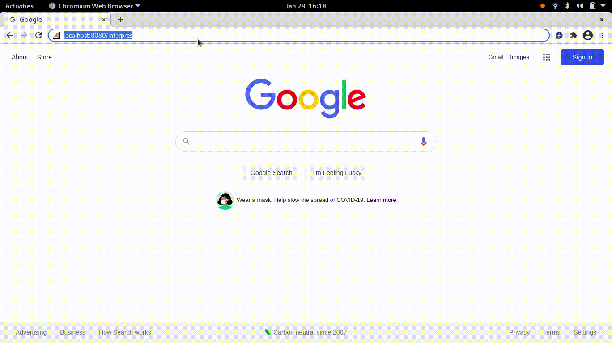

# Interpres

A simple interface to the Nashorn scripting engine as it is implemented by the OpenJDK Java runtime. This is the same interpreter for Javascript that is used in the Cisco UCS Director product line. While it is not a complete mock environment for the environment present there it is certainly a lightweight environment to test non-platform specific code.

## Short Demonstration Video



## Run In A Container

The easiest and supported way to use this tool is via a container runtime. The Nashorn engine is no longer supported in newer versions of the Java runtime so it is easier to get a stable execution environment via a container instead of potentially breaking other Java based applications on a system.

```bash
docker build -t $USER/interpres .
docker run --rm --publish 8080:8080 $USER/interpres
```
